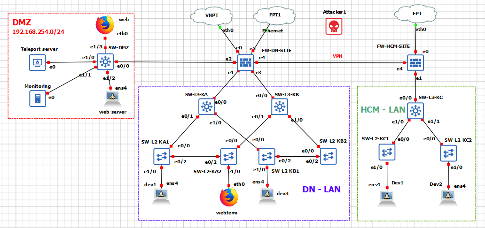
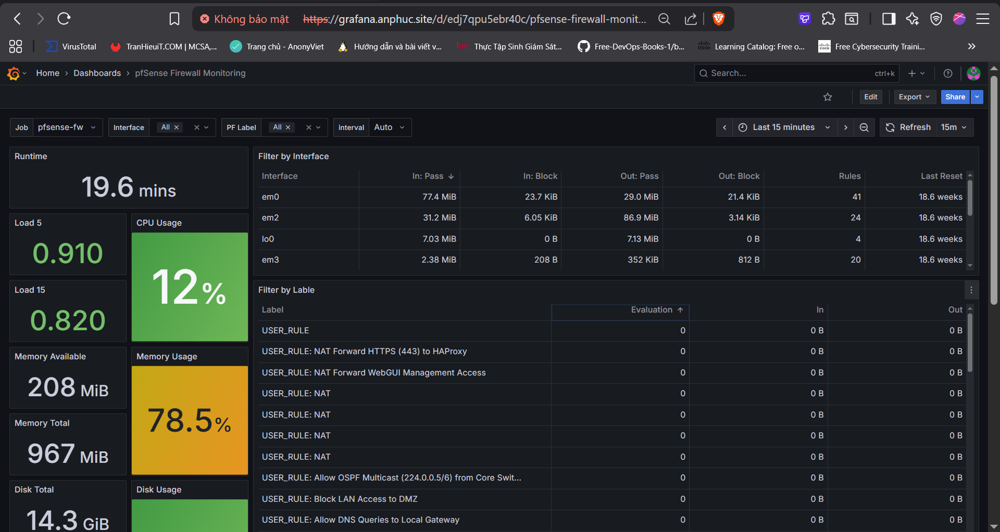
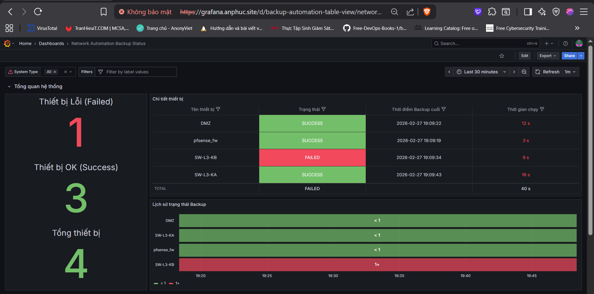
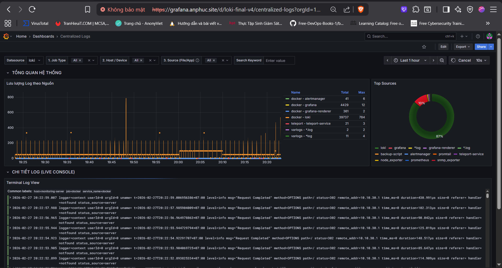
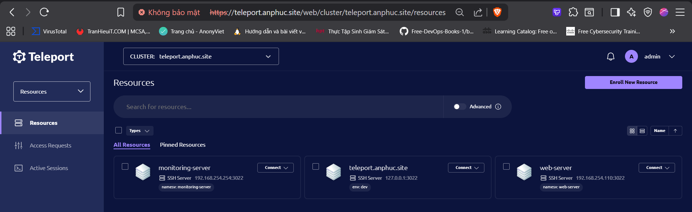
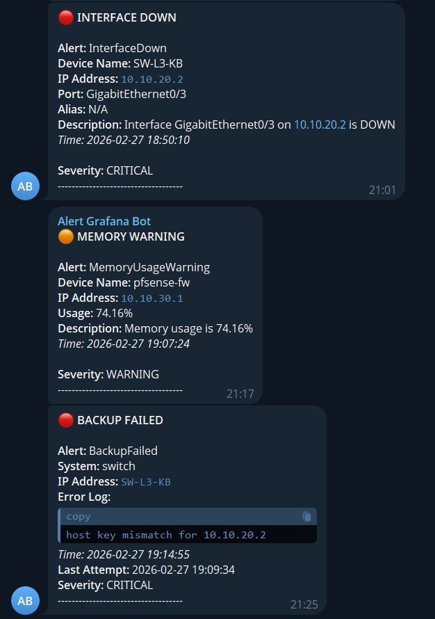
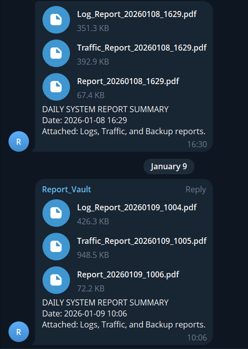
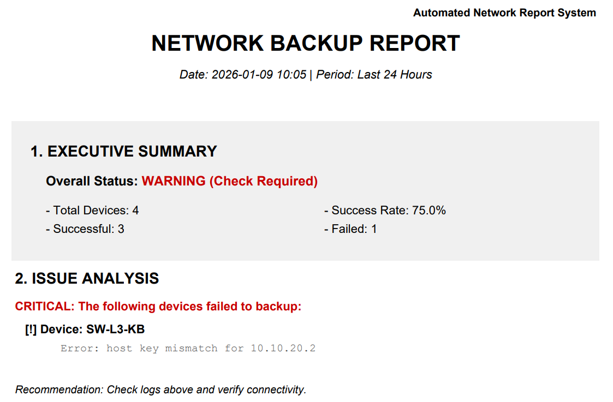
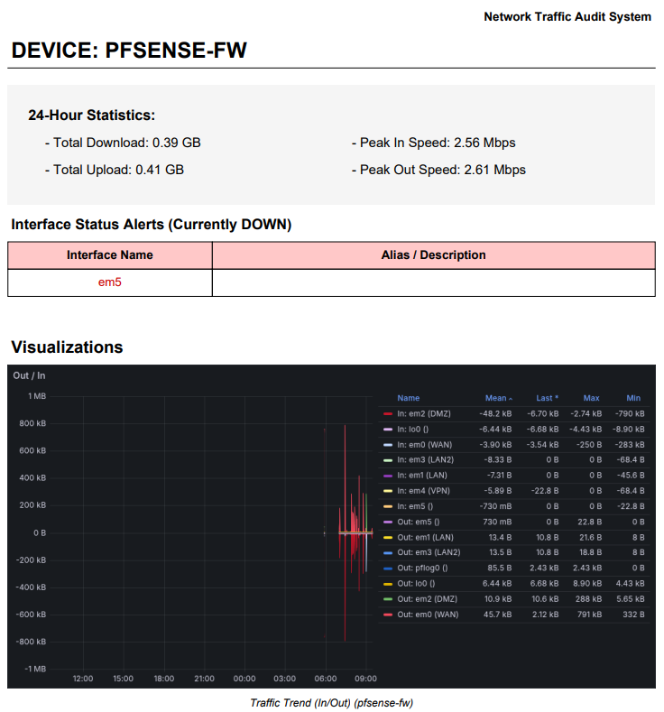
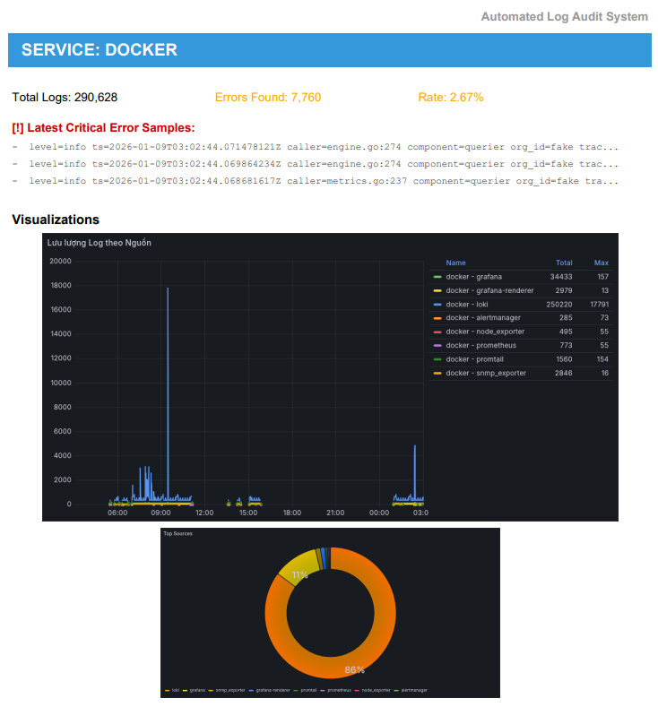

# NetDevOps: Enterprise Network Infrastructure & Automation Lab


## Overview

This project simulates a multi-site enterprise network infrastructure, integrating automated operations **(NetDevOps)**. The system addresses centralized management, ensures High Availability, and provides comprehensive monitoring from the network infrastructure up to the applications.

### Main Objectives

* **Network Infrastructure:** Hierarchical network design, OSPF dynamic routing, and Gateway redundancy using Cisco HSRP.

* **Automation:** Eliminate manual configuration, automate backups and service provisioning using Ansible.

* **Monitoring:** Centralized metrics/logs collection, real-time alerts via Telegram.

* **Security:** Implement Zero Trust Access (Teleport), HAproxy, Snort IDS, and Site-to-Site IPsec VPN.
##  Architecture & Planning

### 1. Topology & Connectivity

The system operates in a Hybrid environment: **GNS3** (Network) combined with **VMware** (Servers).
<p align="center">
  
</p>

* **Gateway Layer:** PFSense handles Firewall, NAT, HAProxy, Site-to-Site IPsec VPN, and Snort IDS.
* **Core/Distribution Layer:** A pair of Cisco L3 Switches running HSRP (Hot Standby Router Protocol) for load balancing and user Gateway redundancy.
* **DMZ Zone:** An isolated zone containing critical servers (Monitoring, Automation, App), protected by strict Firewall Rules.
### 2. IP & VLAN Allocation

The system uses Class C IP ranges (192.168.x.x) structured as 192.168.VlanID.Host, ensuring scalability for multi-site enterprises.

**Site Planning: Da Nang (Site ID: 1)**

| VLAN ID | Subnet | Role | Note | 
| ----- | ----- | ----- | ----- | 
| **10** | `192.168.10.0/24` | Department A | Admin / IT Team | 
| **20** | `192.168.20.0/24` | Department B | HR / Staff | 
| **30** | `192.168.30.0/24` | Department C | Server Farm (Web, App, DB) | 
| **40** | `192.168.40.0/24` | Guest / IoT | Guest Network (Internet Only) | 
| **254** | `192.168.254.0/24` | **DMZ Services** | Monitor/logs/alert

> **Core Switch Configuration:**
>
> * **HSRP Group 10, 30:** Core Switch 1 is Active (Prioritizing Admin/Server traffic).
> * **HSRP Group 20, 40:** Core Switch 2 is Active (Prioritizing Staff/Guest traffic).
> * **Routing:** Using OSPF to advertise internal network ranges and connect to the DMZ zone.
## Tech Stack

| Field | Technology | Deployment Details | 
 | ----- | ----- | ----- | 
| **Infrastructure** | **PFSense** | Firewall, HAProxy, Snort IDS, VPN IPsec | 
|  | **Cisco IOS** | VLAN, Trunking, Etherchannel, HSRP, OSPF | 
| **Automation** | **Ansible** | Configuration Management (IaC), Auto Backup, Service Provisioning | 
|  | **Bash** | Scripting, Menu Automation | 
| **Observability** | **Prometheus** | Metrics Collection (CPU, RAM, Traffic) | 
|  | **Grafana** | Visual Dashboard Display | 
|  | **Loki & Promtail** | Centralized Log Collection and Querying | 
|  | **Alertmanager** | Send alerts via Telegram | 
| **Security** | **Teleport** | Centralized SSH/Web Access Management (Audit & Session Recording) | 


## Directory Structure

```
.
├── Alertmanager                  # Alert configuration
│   └── alertmanager    
│       ├── templates             # Telegram message templates    
│       └── alertmanager.yml    
├── Automation                    # Ansible control center
│   └── automation
│       ├── network-automation
│       │   ├── inventory         # Device list (Hosts)
│       │   └── playbooks         # Automation playbooks
│       │       ├── backup        # PFSense & Switch Backup
│       │       ├── restore       # Configuration Restore
│       │       ├── nginx         # Nginx Service Management
│       │       └── teleport      # Teleport Agent Deployment
│       └── script                # Ansible rapid deployment scripts    
│               └── reports       # Automated reporting scripts   
├── Grafana                       # Dashboards & Provisioning
├── Prometheus                    # Metrics monitoring configuration    
│   ├── prometheus    
│   │   ├── rules                 # Alert rules
│   │   └── snmp.yml              # Network device monitoring OID config    
├── PFSense                       # XML configuration files
└── Switch                        # Startup-configs
```

## Automation Workflows
👉[**Configuration Details**](/Automation/automation/network-automation/)

### 1. Auto Backup Strategy (Disaster Recovery)
The system ensures configuration data safety through an automated backup process.

* **Schedule:** Cronjob runs at **02:00 AM** daily.

* **Targets:** Cisco Switch config (`running-config`) and PFSense config (`config.xml`).

* **Mechanism:** Script automatically SSHes into all devices to fetch files -> Stores with Versioning -> Sends status metrics (Success/Fail) to Prometheus for monitoring.

### 2. Infrastructure Provisioning

Using Ansible Playbooks combined with Python for "End-to-End" service deployment:

* **Nginx & Monitoring:** Automatically install Web Server, configure internal Virtual Host (Port 8080). Automatically install Exporter, then use Python script to update IP into Prometheus config and restart container for instant monitoring.

* **System Tools:** Automatically install Docker, Promtail, Node Exporter on all target devices.

* **Teleport Agent:** Automatically join a new node into the Teleport management cluster with just 1 script.

* **Automated Reports:** Automatically aggregate data, generate PDF reports, and send them periodically via Telegram at 21:00 PM daily.

## Monitoring Stack

The monitoring system is located in the DMZ zone (`VLAN 254`), deployed using **Docker Compose:**

1. **Network Monitoring:**
   * Monitor bandwidth, port status (Up/Down), CRC errors on Switches/Routers via **SNMP.**

   * Track CPU, RAM, Disk Space of servers via **Node Exporter.**
2. **Centralized Logging (PLG Stack):**

   * **Promtail** receives Syslog (UDP 514) from network devices and reads log files from Servers.

   * **Loki** stores and indexes logs.

   * **Grafana** allows searching/filtering logs for troubleshooting.
4. **Alerting:**

   * Automatically send Telegram messages when: Backup fails, unusual high traffic occurs, or a device loses connection.

## Security Implementation

- **Snort IDS:** Detect and prevent network intrusions at the PFSense Gateway.
- **Teleport Access Plane:**
  - Replace traditional SSH Passwords with Certificate-based authentication.
  - Centralized access via Web UI or CLI (`tsh`).
  - Record work sessions (Session Recording) for Auditing.
- **DMZ Segmentation:** Separate network zone for critical servers, isolated from the User network.
- **HAproxy:** Acts as a Reverse Proxy and SSL Offloading, hiding internal infrastructure and enhancing security for public services.
- **IPsec VPN:** Encrypts the transmission line between Da Nang Site and Ho Chi Minh Site.

## Key Outcomes

### 1. Device Automation
- **Automated Backup** 

https://github.com/user-attachments/assets/f61fefcf-a316-4935-922a-d8f5c73947be

- **Automated installation of Docker, Promtail, Node_exporter, Nginx** https://github.com/Bel7phegor/network-lab/raw/main/Images/3.mp4

- **Automated installation of Teleport Agent** https://github.com/Bel7phegor/network-lab/raw/main/Images/1.mp4

### 2. Comprehensive Device Monitoring
* **PFSense Monitoring Dashboard**
<p align="center">
  
</p>

>	Comprehensive monitoring of resources across Linux servers (Monitoring Server, Automation Server, Web Server). \
> Key metrics such as CPU, Memory, Disk I/O, and Network Traffic are displayed in detail for each machine.

* **Automated Backup Monitoring Dashboard**
<p align="center">
  
</p>

> Collects automation metrics and visually displays status and logs.

* **Centralized System Log Dashboard**
<p align="center">
  
</p>

> Search and analyze Syslogs of all network devices, container logs (Docker), and application logs (Nginx) from a single interface.

### 3. Comprehensive Reporting
- Teleport deployment, centralized management
<p align="center">
  
</p>

- Receive alerts via Telegram

<p align="center">
  
  
</p>

>	Instantly displays alert status (CRITICAL/RESOLVED) to administrators when backup processes fail or network connections encounter issues.

- End-of-day Results Report
<p align="center">
  
  
  
</p>

All reports are generated and sent via Telegram::
* **Log report:** [Log_Report_20260227_2101.pdf](./Reports/Log_Report_20260227_2101.pdf)
* **Traffic report:** [Traffic_Report_20260227_2102.pdf](./Reports/Traffic_Report_20260227_2102.pdf)
* **Network report:** [Network_Report_20260227_2103.pdf](./Reports/Report_20260227_2103.pdf)

## Author

**Nguyen An Phuc**
| Fresher DevOps Engineer / Network Engineer |

Interested in building secure, automated DevSecOps pipelines and scalable cloud systems.

📧 [phucan2370@gmail.com](mailto:phucan2370@gmail.com)
🌍 [GitHub](https://github.com/Bel7phegor) | 👉 [LinkedIn](https://www.linkedin.com/in/nguyen-an-phuc/)